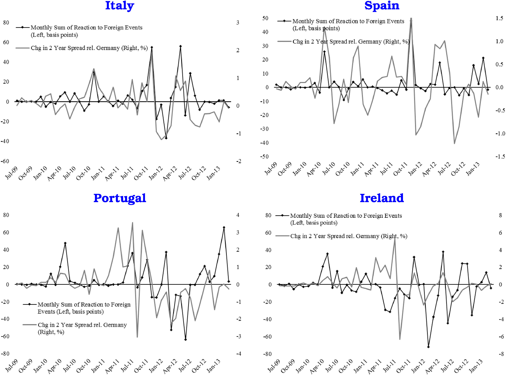
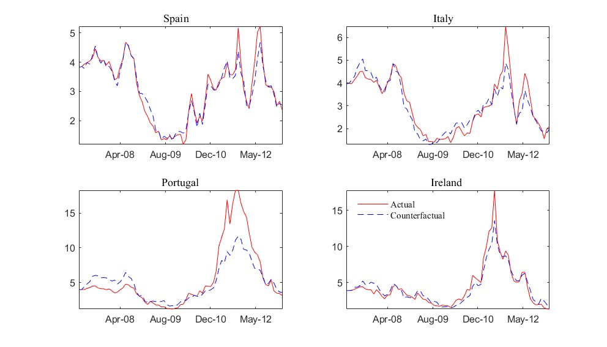

# Sovereign Spreads in the Euro Area: Cross Border Transmission and Macroeconomic Implications

# Summary
Large movements in sovereign spreads were at the heart of the euro crisis. This paper builds a new high-frequency narrative dataset of country specific events in the crisis period to identify shocks to sovereign spreads that are orthogonal to the economy. It finds that an increase in sovereign spreads has a contractionary macroeconomic impact with transmission running through a deterioration in private financial conditions. Moreover, the market reactions to foreign events explains a meaningful share of the variation in a sovereign’s cost of borrowing during the crisis.

---

# Authors and Reference:
[Sovereign Spreads in the Euro Area](https://www.sciencedirect.com/science/article/pii/S0304393219300066) Previously circulated under the title “Systemic Sovereign Risk: Macroeconomic Implications in the Euro Area”. 

- [Saleem Bahaj](https://sites.google.com/site/saleembahaj/home)
- Acknowledgements:
  - I am grateful to the editor, Ricardo Reis, and three anonymous referees for comments that greatly improved this paper. I would like to thank Ambrogio Cesa-Bianchi, James Cloyne, Giancarlo Corsetti, Chryssi Giannitsarou, Marek Jarocinski, Alex Kohlhas, John Lewis, Silvia MirandaAgrippinno, Michele Piffer, Gabor Pinter, Morten Ravn, Donald Robertson, Paulo Surico, Steve Theile, and Stephen Wright for helpful comments and advice. I also thank conference and seminar participants at the Bank of England, the Federal Reserve Board of Governors, Johns Hopkins SAIS, the University of Mannheim, the Cambridge macroeconomics workshop, the EDGE Jamboree, the 7th Rimini Bayesian Econometrics Workshop, the 2014 Econometric Society Winter Meetings and Goldman Sachs for their attention and feedback. I am grateful to the Oesterreichische Nationalbank for awarding this paper with the 2014 Klaus Liebscher award. I would like to acknowledge the Cambridge Endowment for Research in Finance, the Economic and Social Research Council and the Royal Economic Society for financial support. The views expressed here are those of the author and do not necessarily reflect those of the Bank of England, the MPC, the FPC, or the PRC. This work was produced as part of my PhD thesis at the University of Cambridge and not as part of my duties at the Bank of England.
  - Aidan Saggers and Sian Besley provided able research assistance

---
# Full Dataset
- See below for the daily and monthly event reaction series  
  [Italy](./Italy_Instrumets.xlsx)  
  [Spain](./Spain_Instrumets.xlsx)  
  [Ireland](./Ireland_Instrumets.xlsx)  
  [Portugal](./Portugal_Instrumets.xlsx)

- See below for the summary dataset for the country specific events  
  [Event](./EventSpreadsheet.xlsx)

---
# Codes
- See below for the matlab function for the Gibbs Sampler  
  [Gibbs Sampler](./PBVARX_HIERARCHICAL_FUN_COMP.m)
- See below for the main function: runner.m  
  [Runner](./Runner.m)
- The sub functions in runner.m: data_read.m and specification.m build the sample and set up the sampler. See below for these functions  
  [data_read](./data_read.m)  
  [specification](./specification.m)

  
---
# Figures
Below are some key figures visualizing the dataset:

- 
- 

---
# Usage
Please cite if use, and e-mail the authors with suggested corrections.

